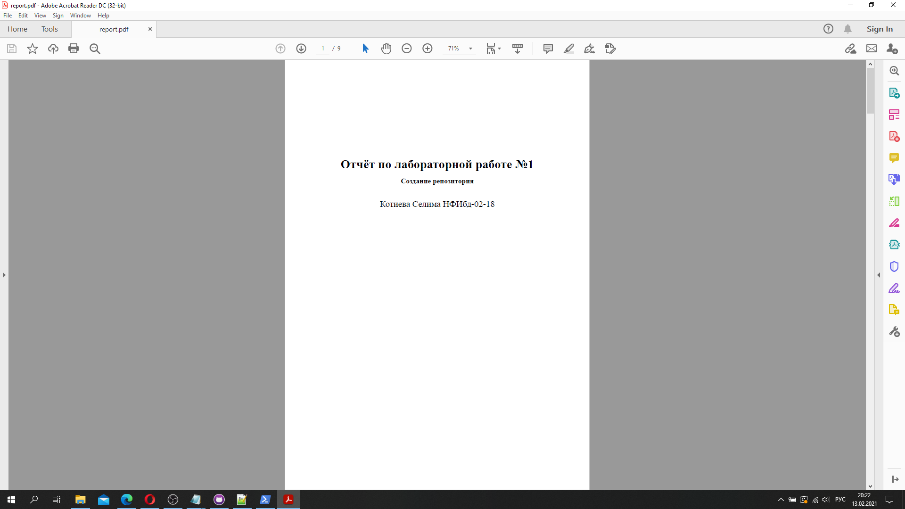

---
## Front matter
lang: ru-RU
title: Отчёт по Лабораторной работе №1
author: |
	Котиева Селима{1}
	
institute: |
	\inst{1}RUDN University, Moscow, Russian Federation
	
date: MathMod, 13 Feb -- 4 , 2021 Russia, Moscow

## Formatting
mainfont: Times New Roman
romanfont: Times New Roman
sansfont: Times New Roman
monofont: Times New Roman
toc: false
slide_level: 2
theme: metropolis
header-includes:
- \metroset{progressbar=frametitle,sectionpage=progressbar,numbering=fraction}
- '\makeatletter'
- '\beamer@ignorenonframefalse'
- '\makeatother'
aspectratio: 43
section-titles: true
---

# Дисциплина: Математическое моделирование

## Цель работы:

- Ознакомиться с протоколом Git. 
- Создать репозиторий. 
- Создание отчёта на Markdown.

## Задание:

1. Зарегистрироваться на GitHub.
2. Создать репозиторий.
3. Создать отчет на markdown.
4. Конвертировать его в docx и pdf.
5. Создать презентацию.
6. Загрузить отчет.

## Выполнение лабораторной работы
1. Регистрируемся на GitHub и создаем репозиторий.
{ #fig:001 width=70% }

3. Создаём отчет на markdown.
{ #fig:001 width=70% }

4. Конвертируем его в docx и pdf.
{ #fig:001 width=70% }
{ #fig:001 width=70% }

5. Создаем презентацию.
{ #fig:001 width=70% }

6. Загружаем отчёт.

##Результаты и вывод:
- Ознакомились с протоколом Git. 
- Создали репозиторий. 
- Создали отчёта на Markdown.
