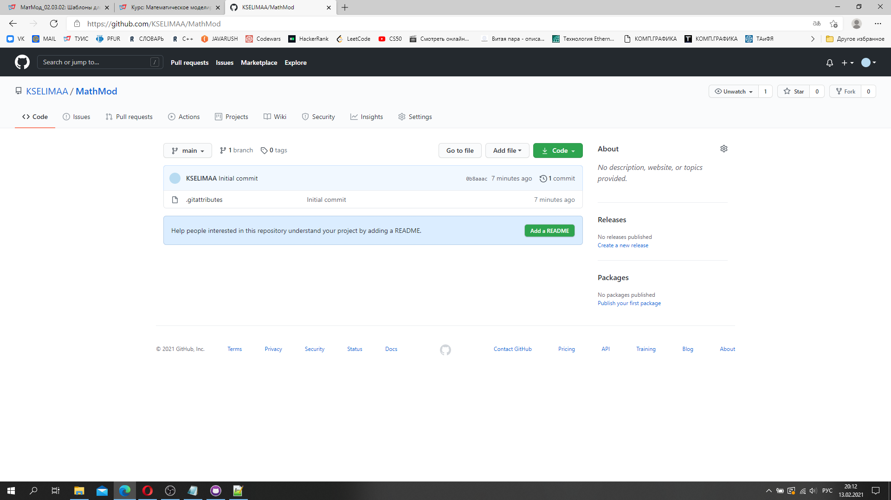

---
## Front matter
lang: ru-RU
title: Отчёт по Лабораторной работе №1
author: |
	Котиева Селима{1}
	
institute: |
	\inst{1}RUDN University, Moscow, Russian Federation
	
date: MathMod, 13 Feb -- 4 , 2021 Russia, Moscow

## Formatting
mainfont: Times New Roman
romanfont: Times New Roman
sansfont: Times New Roman
monofont: Times New Roman
toc: false
slide_level: 2
theme: metropolis
header-includes:
- \metroset{progressbar=frametitle,sectionpage=progressbar,numbering=fraction}
- '\makeatletter'
- '\beamer@ignorenonframefalse'
- '\makeatother'
aspectratio: 43
section-titles: true
---

# Дисциплина: Математическое моделирование

## Цель работы:

- Научиться работать с GitHub. 
- Научиться создавать отчёты на Markdown и конвертировать его в другие форматы.

## Задание:

1. Зарегистрироваться на GitHub.
2. Создать репозиторий.
3. Создать отчет на markdown.
4. Конвертировать его в docx и pdf.
5. Создать презентацию.
6. Загрузить отчет.

## Выполнение лабораторной работы
1. Регистрируемся на GitHub и создаем репозиторий.
{ #fig:001 width=90% }

## Выполнение лабораторной работы
3. Создаём отчет на markdown.
{ #fig:001 width=90% }

## Выполнение лабораторной работы
4. Конвертируем его в docx и pdf.
{ #fig:001 width=50% }
{ #fig:001 width=50% }

## Выполнение лабораторной работы
5. Создаём презентацию.

{ #fig:001 width=50% }
{ #fig:001 width=50% }

6. Загружаем отчёт на GitHub и ТУИС.

## Результаты и вывод:

- Ознакомились с протоколом Git. 
- Создали репозиторий. 
- Создали отчёт на Markdown и конвертировали его в дргуие форматы.
